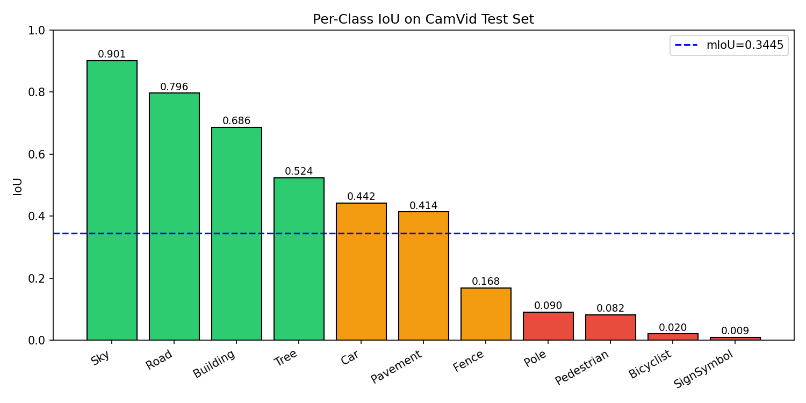
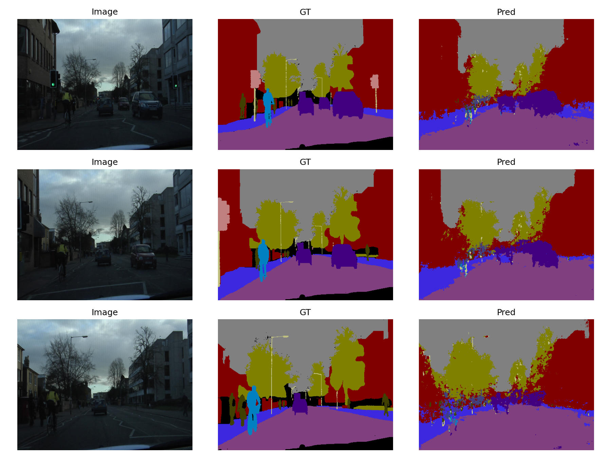

# 基于 SegNet 的 CamVid 街景语义分割

使用 PyTorch 实现 [SegNet](https://arxiv.org/abs/1511.00561) 网络，在 CamVid
街景数据集上完成 11 类语义分割任务。

## 实验结果

在单 GPU 上从零训练 50 个 epoch，测试集结果：

| 评价指标 | 数值 |
|---|---|
| 像素准确率（PA） | 0.8012 |
| 平均像素准确率（mPA） | 0.4094 |
| 平均交并比（mIoU） | 0.3445 |

### 各类别 IoU



### 分割效果可视化

下图从左到右依次为：原始图像、真值标注、模型预测



## 网络结构

SegNet 是一种编码器-解码器（Encoder-Decoder）结构的语义分割网络，编码器
基于 VGG16 的卷积部分，解码器与编码器对称。

**核心创新**：编码器在最大池化时保存位置索引（pooling indices），解码器
利用这些索引进行非线性上采样。这种设计在零参数代价下精确还原边界细节。


编码器: 64-64 | 128-128 | 256-256-256 | 512-512-512 | 512-512-512
解码器: 512-512-512 | 512-512-256 | 256-256-128 | 128-64 | 64-类别数


## 项目结构


.
├── dataset.py # CamVid 数据集加载
├── model.py # SegNet 网络模型
├── metrics.py # PA / mPA / mIoU 评估指标
├── train.py # 训练与测试主程序
├── visualize.py # 测试集预测结果可视化
├── result.png # 分割效果图
└── iou_bar.png # 各类 IoU 柱状图


## 环境配置

```bash
# 创建 conda 环境
conda create -n segnet python=3.10 -y
conda activate segnet

# 安装依赖
pip install torch torchvision tqdm matplotlib pillow numpy
数据集准备

本项目使用 11 类版本的 CamVid 数据集：

git clone https://github.com/alexgkendall/SegNet-Tutorial.git
ln -s SegNet-Tutorial/CamVid ./CamVid

数据集结构：

CamVid/
├── train/         （367 张训练图像）
├── trainannot/    （367 张训练标签）
├── val/           （101 张验证图像）
├── valannot/      （101 张验证标签）
├── test/          （233 张测试图像）
└── testannot/     （233 张测试标签）
使用方法
训练模型
python train.py

在主流 GPU 上训练 50 epoch 约 5 分钟（batch size 为 4）。最佳模型权重
会保存到 segnet_best.pth。

可视化预测
python visualize.py

会生成 result_more.png 展示模型在测试集上的预测效果。

训练超参数
参数	值
优化器	Adam
初始学习率	1e-3
学习率策略	StepLR（step=20，γ=0.5）
权重衰减	5e-4
Batch Size	4
Epoch	50
损失函数	CrossEntropy（ignore_index=11）
改进方向

使用 ImageNet 预训练的 VGG16 权重初始化编码器，加速收敛并提升精度

加权交叉熵损失，缓解小类别（Pole、Pedestrian、Bicyclist）的不平衡问题

数据增强：随机翻转、随机裁剪、亮度抖动

使用 Focal Loss 或 Dice Loss 替代 CE 损失

参考文献

Badrinarayanan et al. SegNet: A Deep Convolutional Encoder-Decoder
Architecture for Image Segmentation. TPAMI 2017.

CamVid 数据集主页

许可证

MIT License
