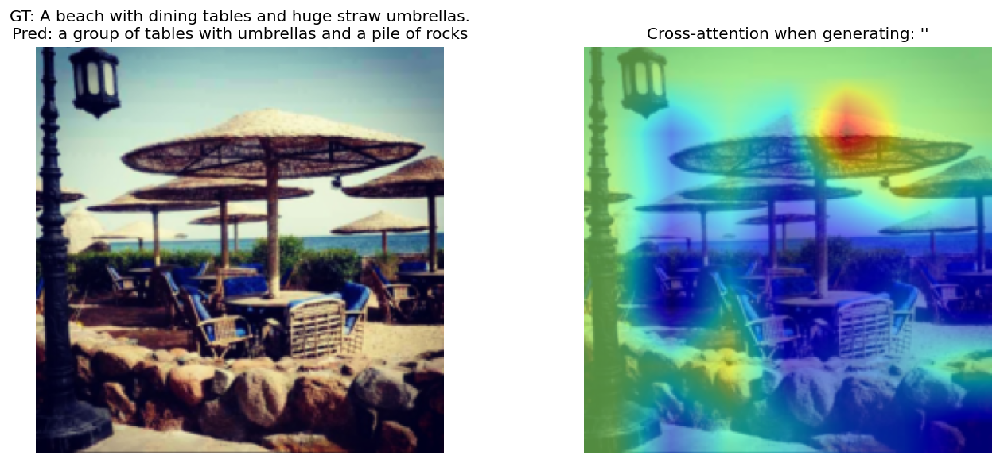
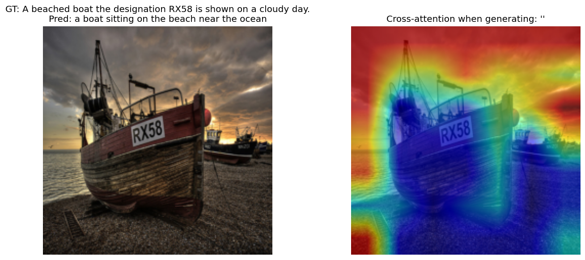
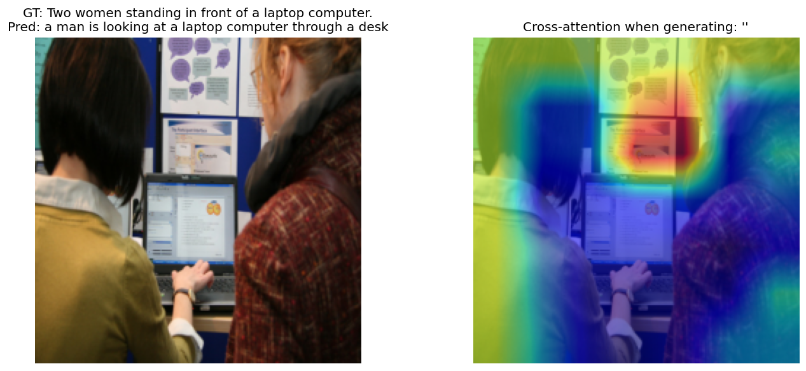
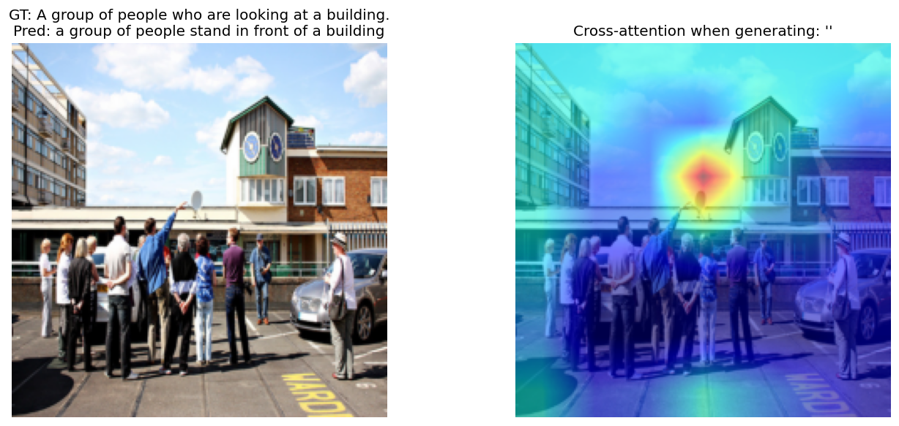

# 实验八：基于 CNN-Transformer 的图像描述生成

小组成员：朱立景、徐康晴、吕正大

实验代码仓库：https://github.com/xinhanzhongjiu/UCAS_DeepLearning_2026

## 一、概述

### 1.1 任务目标

本实验实现 **图像描述（Image Captioning）** 任务：给定一张自然图像，模型自动生成一句与图像内容相关的英文描述。核心难点在于同时理解视觉语义与语言结构，并将二者对齐到统一的序列生成框架中。

### 1.2 数据集

实验使用 **MSCOCO 2017** 字幕子集：

| 项目 | 说明 |
|------|------|
| 图像 | `train2017`，共 **118,287** 张 |
| 标注 | `captions_train2017.json`，每张图约 5 条英文描述 |
| 划分 | 按 `image_id` 随机划分 **80% / 10% / 10%**（train / val / test），`seed=42` |
| 预处理 | Resize 至 224×224，ImageNet 均值方差归一化 |
| 测试集规模 | val **11,828** 张，test **11,830** 张（见 `results/metrics_*.json`） |

### 1.3 解决方案概览

本实验采用 **CNN + Transformer Encoder-Decoder** 架构：

1. **ResNet50** 提取 7×7 空间视觉特征；
2. **Transformer Encoder** 建模区域间关系，得到视觉 memory；
3. **Transformer Decoder** 在 cross-attention 条件下自回归生成字幕；
4. 训练目标为 **交叉熵损失**（Teacher Forcing）；
5. 另实现 **CNN + LSTM** 基线，在相同数据划分下对比。

开发与运行环境：conda 环境 （python=3.12 torch=2.6.0+cu124）。

---

## 二、解决方案

### 2.1 整体架构

```
图像 (3×224×224)
  → ResNet50（layer4 输出 7×7×2048）
  → 展平为 49 个视觉 token + Linear 投影 + 2D 可学习位置编码
  → Transformer Encoder（3 层）
  → Memory (49×512)
字幕 token（Teacher Forcing）
  → Embedding + 正弦位置编码
  → Transformer Decoder（3 层，含 cross-attention）
  → Linear → 词表 logits
```

对应代码结构见 `model.py`、`train.py`、`dataset.py`。

### 2.2 网络结构设计

#### （1）CNN 视觉编码器

使用 ImageNet 预训练 **ResNet50**，去掉全局池化与全连接层，保留 `layer4` 输出的 **7×7 空间特征图**，再 reshape 为 49 个区域 token。为降低过拟合与显存压力，冻结 `conv1` 至 `layer3`，仅微调 `layer4` 及后续模块。

```python
# model.py - CNNEncoder 核心
x = self.layer4(x)                    # (B, 2048, 7, 7)
x = x.flatten(2).transpose(1, 2)      # (B, 49, 2048)
feats = self.img_proj(feats)          # 投影到 d_model=512
feats = self.img_pos(feats)           # 2D 可学习位置编码
memory = self.encoder(feats)          # Transformer Encoder
```

#### （2）2D 可学习位置编码（创新点 ①）

不同于将 CNN 特征全局池化为一向量，本实验 **保留空间结构**，并为 7×7 网格引入 **可学习 2D 位置编码** `LearnablePositionalEncoding2D`，使 Decoder 的 cross-attention 能关注到具体图像区域。

```python
class LearnablePositionalEncoding2D(nn.Module):
    def __init__(self, d_model: int, height: int = 7, width: int = 7):
        super().__init__()
        self.pos = nn.Parameter(torch.randn(1, height * width, d_model) * 0.02)

    def forward(self, x: torch.Tensor) -> torch.Tensor:
        return x + self.pos[:, : x.size(1), :]
```

#### （3）Transformer Encoder-Decoder

| 超参数 | 取值 |
|--------|------|
| `d_model` | 512 |
| `nhead` | 8 |
| Encoder / Decoder 层数 | 3 / 3 |
| `dim_feedforward` | 2048 |
| `dropout` | 0.1 |
| 最大字幕长度 | 40 |

文本侧使用 **Embedding + 正弦位置编码**；Decoder 采用因果 mask 做自回归建模，并通过 **multi-head cross-attention** 读取视觉 memory。

#### （4）LSTM 基线（`model_baseline.py`）

为公平对比，基线使用 **同一 ResNet50 特征**，对 49 个 token 做 **全局平均池化** 得到图像向量，再输入 **单层 LSTM** 解码。除解码器外，CNN 与训练配置保持一致。

### 2.3 数据处理与词表

- 图像：`Resize(224,224)` → `ToTensor()` → `Normalize(ImageNet mean/std)`
- 训练时：每张图 **随机采样 1 条** caption
- 评测时：每张图保留 **全部 5 条** reference，指标取 max-over-references（COCO 标准做法）
- 分词：优先 `bert-base-uncased`；网络不可达时从 COCO 词频构建本地 `CaptionTokenizer`（创新点 ②：离线词表回退）

### 2.4 损失函数设计

采用 **Token 级交叉熵损失**，对 padding 位置忽略：

```python
# train.py
criterion = nn.CrossEntropyLoss(ignore_index=pad_idx, label_smoothing=0.0)
logits = model(images, captions)           # Teacher Forcing
tgt_out = captions[:, 1:]                  # 右移一位作为目标
loss = criterion(logits.reshape(-1, V), tgt_out.reshape(-1))
```

- 输入 caption 为 `[CLS] w1 w2 ... [SEP]`
- 模型预测 `w1, w2, ..., [SEP]`
- 未使用强化学习（SCST）或 CIDEr 直接优化，以保证训练稳定

### 2.5 优化器与训练策略

| 配置项 | 取值 |
|--------|------|
| 优化器 | **AdamW** |
| 学习率 | 1e-4 |
| Weight decay | 1e-4 |
| 梯度裁剪 | 1.0 |
| Batch size | 32 |
| Epochs | 30 |
| 混合精度 | AMP（`use_amp: true`） |
| 模型选择 | 验证集 loss 最低 → `checkpoints/best.pt` |

```python
optimizer = torch.optim.AdamW(
    filter(lambda p: p.requires_grad, model.parameters()),
    lr=1e-4, weight_decay=1e-4,
)
torch.nn.utils.clip_grad_norm_(model.parameters(), 1.0)
```

推理阶段使用 **Beam Search（beam_size=3）** 生成字幕。

### 2.6 其他工程改进（创新点 ③④）

1. **METEOR 分块评测**：全量 1.1 万+ 样本一次性调用 `meteor.jar` 易协议错位，采用 `meteor_chunk_size=256` 分批计算，失败时回退 NLTK METEOR。
2. **Cross-Attention 可视化**：在最后一层 Decoder 显式调用 `multihead_attn(..., need_weights=True)` 提取 7×7 注意力，上采样叠加至原图，便于分析模型“看哪里、说什么”。

---

## 三、实验分析

### 3.1 实验设置

| 项目 | 配置 |
|------|------|
| 硬件 | NVIDIA GPU A800（CUDA） |
| 框架 | PyTorch 2.6 + torchvision |
| 数据 | MSCOCO 2017 全量 train2017 |
| 划分 | 80% train / 10% val / 10% test（按 image_id，`seed=42`） |
| 评测指标 | BLEU-1/4、METEOR、ROUGE-L、CIDEr |
| 对比基线 | 同划分下的 CNN-LSTM |

> **说明**：本实验采用随机 80/10/10 划分，与 Karpathy 标准 split 不同，数值 **不宜与文献直接横向对比**，重点观察 **Transformer vs LSTM** 的相对提升。

### 3.2 定量结果

#### 表 1：CNN-Transformer 在 val / test 上的指标

| 划分 | BLEU-1 | BLEU-4 | CIDEr | METEOR | ROUGE-L | 样本数 |
|------|--------|--------|-------|--------|---------|--------|
| **val** | 0.6599 | 0.2496 | 0.7577 | 0.2654 | 0.4515 | 11,828 |
| **test** | 0.6561 | 0.2465 | 0.7487 | 0.2633 | 0.4490 | 11,830 |

数据来源：`results/metrics_val.json`、`results/metrics_test.json`。

#### 表 2：Test 集上 Transformer 与 LSTM 基线对比

| 模型 | BLEU-4 | CIDEr | METEOR | ROUGE-L |
|------|--------|-------|--------|---------|
| **CNN-Transformer** | **0.2465** | **0.7487** | **0.2633** | **0.4490** |
| CNN-LSTM | 0.1796 | 0.5611 | 0.2430 | 0.4107 |
| **相对提升** | +37.2% | +33.4% | +8.3% | +9.3% |

数据来源：`results/compare_test.md`、`results/metrics_test_baseline.json`。

#### 表 3：与文献参考值（Karpathy split，仅供参考）

| 方法 | BLEU-4（约） |
|------|-------------|
| Show-and-Tell (VGG+LSTM) | ~27 |
| NIC | ~27 |
| 现代 Transformer 系 | 35+ |

本实验 test BLEU-4 = **0.2465**（即约 24.65，按 pycocoevalcap 0–1 计），与经典 LSTM 方法量级接近，但划分不同，仅作背景参考。

### 3.3 定性分析与样例

#### （1）生成质量较好的样例

| 图像场景 | Ground Truth（节选） | 模型预测 |
|----------|---------------------|----------|
| 机场飞机 | A large jetliner sitting on top of an airport tarmac. | a large passenger jet sitting on top of an airport tarmac |
| 滑板少年 | A young boy stands and balances on a skateboard. | a little boy that is on a skateboard |
| 海滩场景 | A beached boat... on a cloudy day. | a boat sitting on the beach near the ocean |

模型能正确识别 **飞机、滑板、海滩/船** 等主体与场景，句式多为 “a/an + 名词短语 + 介词短语”，符合 COCO 描述风格。

#### （2）典型错误类型

| 错误类型 | 样例 | 分析 |
|----------|------|------|
| **对象混淆** | GT: Two **women**... → Pred: a **man** is looking at a laptop | 对人物性别/数量感知不足 |
| **动作误判** | GT: holding a **tennis racquet** → Pred: trick on a **skateboard** | 相似运动场景混淆 |
| **细节遗漏** | GT: British Airways, rainy day → Pred: 仅描述 airplane on tarmac | 品牌、天气等细粒度信息难生成 |
| **基线重复/胡言** | LSTM: ...to her face to her face | LSTM 易出现重复 n-gram，Transformer 明显更流畅 |

LSTM 基线样例（同图 145621）：GT 为 “man checking cell phone”，基线预测为 “man holding a blue and white **toothbrush**”，说明 **全局池化 + 递归解码** 在细粒度物体识别上弱于带 spatial attention 的 Transformer。

### 3.4 可视化分析

对 test 集抽样 20 张图像，统计如下（`results/analysis.md`）：

- **字幕长度**：medium 19 张，long 1 张
- **内容类型（启发式）**：object 15，scene 4，action 1

#### 可视化样例 1：场景描述（海滩餐桌）



- **GT**：A beach with dining tables and huge straw umbrellas.
- **Pred**：a group of tables with umbrellas and a pile of rocks
- **分析**：模型捕捉到 tables、umbrellas、beach 相关语义；右图 cross-attention 高亮区域与物体所在位置大致对应。

#### 可视化样例 2：场景描述（搁浅的船）



- **GT**：A beached boat the designation RX58 is shown on a cloudy day.
- **Pred**：a boat sitting on the beach near the ocean
- **分析**：核心对象 **boat + beach** 正确；未生成船名 RX58 和 cloudy day 等细节。

#### 可视化样例 3：对象识别（笔记本）



- **GT**：Two women standing in front of a laptop computer.
- **Pred**：a man is looking at a laptop computer through a desk
- **分析**：识别出 **laptop**；人物数量与性别错误，说明人物属性仍是短板。

#### 可视化样例 4：生成较准确样例（建筑前人群）



- **GT**：A group of people who are looking at a building.
- **Pred**：a group of people stand in front of a building
- **分析**：语义与 GT 高度一致，BLEU/CIDEr 表现应较好。

#### 注意力热力图解读

右图展示 Decoder **生成最后一个词时** 对 7×7 图像区域的 cross-attention。颜色越暖表示关注度越高。相比早期 hook 方案，当前实现通过 `need_weights=True` **稳定输出** 热力图，可用于：

- 检查模型是否“看”向正确物体；
- 对比 object / scene / action 类图像的注意力分布差异。

### 3.5 综合讨论

**优势：**

1. 空间特征 + Transformer cross-attention 使 BLEU-4、CIDEr 相比 LSTM 基线提升 **约 33%–37%**；
2. 生成句子语法较流畅，常见 COCO 模板（a/an + noun + prep phrase）掌握较好；
3. 全量 11.8 万训练图像、30 epoch 训练后指标稳定，val/test 一致（BLEU-4 约 0.25）。

**不足：**

1. 细粒度属性（颜色、品牌、天气、人数/性别）仍易出错；
2. 倾向生成安全、通用的描述，多样性不足；
3. 未使用 CIDEr 强化学习微调，指标仍低于 SOTA Transformer captioner；
4. 与 Karpathy split 文献值不可直接对比。

**可改进方向：**

- 更大预训练视觉 backbone（ViT、CLIP）；
- Scheduled Sampling 或 SCST 以 CIDEr 为 reward 微调；
- 更长训练或 label smoothing；
- 使用官方 Karpathy split 以便与论文对比。

---

## 四、总结

本实验在 MSCOCO 2017 上完成了 **CNN-Transformer 图像描述模型** 的设计、训练与评测。模型以 **ResNet50 空间特征 + 3 层 Transformer Encoder-Decoder** 为核心，配合交叉熵损失与 AdamW 优化，在 test 集上取得 **BLEU-4 = 0.2465、CIDEr = 0.7487、METEOR = 0.2633**，显著优于同划分下的 **CNN-LSTM 基线**（BLEU-4 = 0.1796、CIDEr = 0.5611）。

实验表明：**保留空间结构的视觉 token 与 Transformer cross-attention 解码**，相比全局池化 + LSTM，能更有效地建立“图像区域—单词”对应关系，生成更准确的英文描述。通过注意力可视化，可进一步直观理解模型的推理过程及其在对象、场景类图像上的优劣。

---

## 附录：复现实验命令

```bash
conda activate yolo
cd UCAS_DeepLearning_2026/exp8
pip install -r requirements.txt

python download_data.py              # 下载 MSCOCO
python train.py --max-images 0       # 全量训练 Transformer
python train.py --baseline --max-images 0   # 训练 LSTM 基线
python evaluate.py --split test
python evaluate.py --split test --baseline
python compare_baselines.py --split test
python visualize.py --num-samples 20
```

主要结果文件：

- `results/metrics_val.json` / `results/metrics_test.json`
- `results/metrics_test_baseline.json`
- `results/compare_test.md`
- `results/vis/`（注意力与预测可视化）
